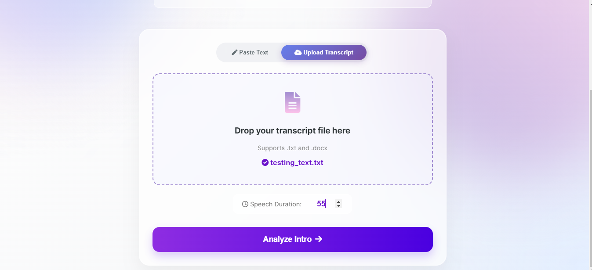
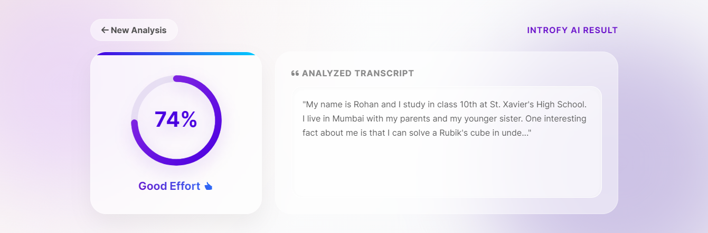
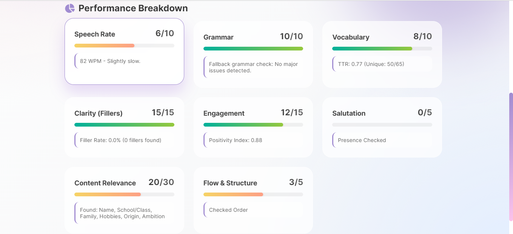

<p align="center">
  
</p>

# 📘 **IntroFY AI – Smart Intro Evaluation System**

IntroFY AI is an intelligent web application that **analyzes spoken or written introductions** and provides:

* 🧠 **Semantic Understanding**
* ✍️ **Grammar Evaluation (Fallback Auto-Grammar Engine)**
* 🔍 **Keyword & Content Structure Checks**
* 🎯 **Clarity & Coherence Scoring**
* 📚 **Readability Metrics**
* 📈 **Final Weighted Score**

Built with **Flask**, **spaCy**, **Sentence-Transformers**, **NLTK**, and smart fallback logic to ensure compatibility even on older systems.

---

## 📸 UI Preview

<table>
  <tr>
    <td align="center">
      <strong>Home Page</strong><br>
      
    </td>
    <td align="center">
      <strong>Manual Input</strong><br>
      
    </td>
  </tr>
  <tr>
    <td align="center">
      <strong>Result Page</strong><br>
      
    </td>
    <td align="center">
      <strong>Analysis Breakdown</strong><br>
      
    </td>
  </tr>
</table>

---


## 🚀 Features

### 🔹 **1. Smart Content Analysis**

* Detects personal intro components (Name, Location, Hobbies, Strengths).
* Uses semantic matching to understand meaning (Sentence Transformer).

### 🔹 **2. Grammar & Structure Evaluation**

* Auto fallback grammar engine (since LanguageTool is not supported on Win 8.1).
* Detects long sentences, improper capitalization, lower-case “i”, and more.

### 🔹 **3. Readability & Flow**

* Analyzes sentence flow using:

  * Flesch Reading Ease
  * Sentence count
  * Word count
  * Average sentence length

### 🔹 **4. Advanced Semantic Relevance**

* Embedding-based semantic similarity using:

  * `all-MiniLM-L6-v2` transformer model
* Torch CPU-only runtime (to avoid CUDA DLL issues).

### 🔹 **5. File Upload Support**

* Upload `.txt` or `.docx` or directly paste your intro.

### 🔹 **6. Clean & Responsive UI**

* Simple form-based input.
* Score breakdown page for detailed insights.

---

## 🛠️ Tech Stack

| Component        | Technology                                                      |
| ---------------- | --------------------------------------------------------------- |
| Backend          | **Flask**                                                       |
| NLP              | **spaCy 3.2.6**, **Sentence-Transformers**, **NLTK**, **VADER** |
| Semantic Model   | **all-MiniLM-L6-v2**                                            |
| File Parsing     | **python-docx**                                                 |
| Readability      | **textstat**                                                    |
| Frontend         | HTML/CSS/Jinja templates                                        |
| Deployment Ready | Vercel / Render / PythonAnywhere                                |

---

## 📂 Project Structure

```
introfy-ai/
│
├── app.py              # Flask web server
├── logic.py            # Core AI scoring engine
├── setup_env.py        # Environment setup for NLTK & spaCy
├── requirements.txt    # Project dependencies
│
├── templates/
│   ├── index.html      # Input form page
│   └── result.html     # Results display page
│
└── uploads/            # Temporary upload folder (auto-created)
```

---

## ⚙️ Installation & Setup

### 1️⃣ Clone the Repository

```bash
git clone https://github.com/YOUR_USERNAME/introfy-ai.git
cd introfy-ai
```

### 2️⃣ Create Virtual Environment

```bash
python -m venv vir_env
vir_env\Scripts\activate
```

### 3️⃣ Install Dependencies

```bash
pip install -r requirements.txt
```

### 4️⃣ Install spaCy Model

```bash
python -m spacy download en_core_web_sm
```

OR (if web download fails)

```bash
pip install en_core_web_sm-3.2.0-py3-none-any.whl
```

### 5️⃣ Download NLTK Data

```bash
python setup_env.py
```

---

## ▶️ Running the App

```bash
python app.py
```

Visit:

```
http://127.0.0.1:5000
```

---

## 🌐 Deploying on Vercel

1. Push your project to GitHub.
2. Go to Vercel → **New Project**.
3. Import your GitHub repository.
4. Ensure:

   * Runtime = **Python**
   * Entry file = **app.py**
5. Deploy.

⛔ Note: Vercel uses a **readonly file system**, so `UPLOAD_FOLDER` is mapped to `/tmp/uploads/`.

---

## 🧩 Known System Adaptations

To ensure compatibility on older systems (like Windows 8.1):

* `spaCy==3.2.6`
* CPU-only Torch
* Disabled LanguageTool (fallback grammar engine enabled)
* Temporary file directories mapped to OS temp folders

These ensure the project **runs anywhere**, even on older hardware.

---

## 📜 License

MIT License — free to use, modify, and build upon.

---

## ✨ Author

**Harshal**
Final Year AI & DS Engineer
Creator of IntroFY AI
